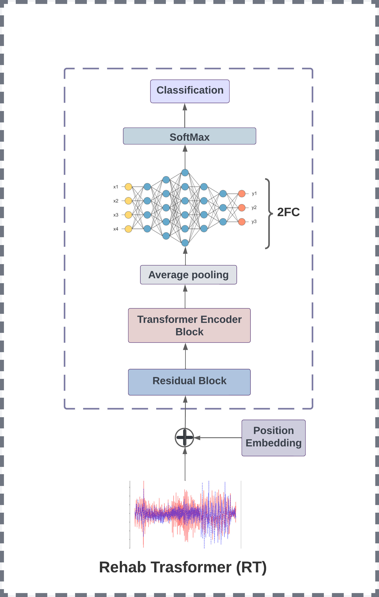
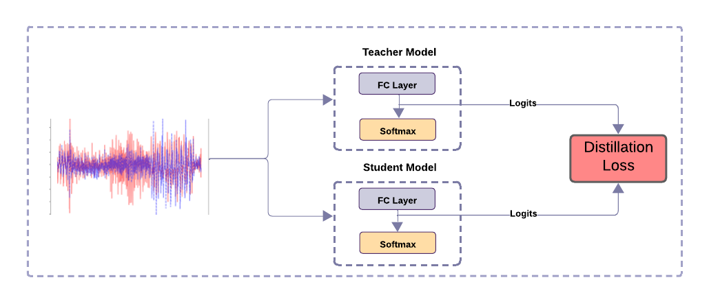

## 🧠 Rehab Transformer (RT)

**Rehab Transformer (RT)** is a lightweight deep learning model designed to classify **rehabilitation exercises** and **daily activities** from motion data using the **SPARS9x** dataset. It is optimized to run on resource-constrained devices such as wearable sensors or mobile applications.

This project implements **Knowledge Distillation** to train a smaller and more efficient **Student model** to mimic a larger and more complex **Teacher model**.

---

### 📦 Dataset: SPARS9x

The model is trained on **SPARS9x**, a rich multi-sensor dataset that contains inertial data recorded during physical rehabilitation exercises and everyday activities. Each sample represents a sequence of motion signals recorded using IMU (Inertial Measurement Unit) sensors.

---

### 🏗️ Model Architecture

The following diagram illustrates the core Rehab Transformer model:

The architecture consists of the following components:

- **📍 Positional Embeddings**  
  Adds temporal context to the input signal sequence.

- **🧠 Depthwise Separable Convolutions**  
  Efficient convolutional blocks that reduce parameter count while preserving performance.

- **🔁 Residual Blocks**  
  Enable deep feature extraction while preserving gradient flow through skip connections.

- **🧱 Transformer Encoder Layer**  
  Uses self-attention to model long-range dependencies between time steps in the motion sequence.

- **🔄 Average Pooling**  
  Reduces the output dimension before classification.

- **🔢 Fully Connected Layers (2FC)**  
  Two dense layers followed by a `SoftMax` layer to classify into exercise/activity categories.

---

### 🔄 Knowledge Distillation

To optimize the model for deployment on lightweight platforms, **Knowledge Distillation** is used. A **Teacher model** with high capacity is trained first, and its outputs are then used to supervise the training of a **Student model**, which is faster and more efficient.

> 🔧 *Please replace `knowledge_distillation_diagram.png` with your actual diagram if different.*

---

### 🎯 Objective

The objective of this model is to accurately recognize and classify various rehabilitation exercises and daily activities, enabling intelligent and context-aware feedback systems for physical therapy and monitoring.

---

### 📁 File Overview

- `fig1.jpeg`: Architecture of the Rehab Transformer (RT)
- `fig2.png`: Overview of the teacher–student distillation process 

---

